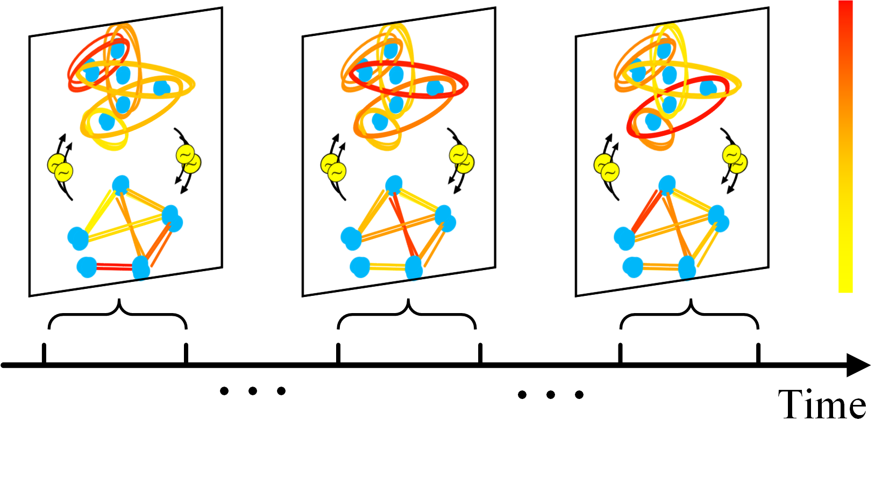
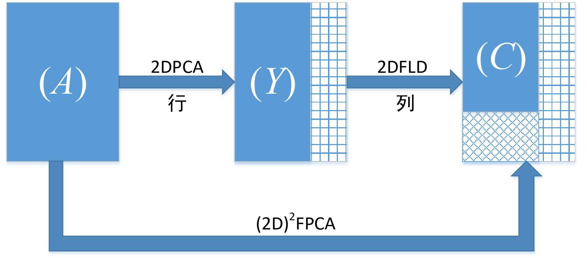

If you want to see more, please enter my [Github page](https://github.com/j1o2h3n).

## DDSTGCN
[DDSTGCN](https://github.com/j1o2h3n/DDSTGCN) is a deep learning model for traffic prediction proposed by me in 2020. The model has achieved state-of-the-art on six real-world public traffic datasets.

## (2D)^2FPCA
[(2D)^2FPCA](https://github.com/j1o2h3n/2D2FPCA) is a project that I completed in 2019 about image recognition and classification tasks of machine learning dimensionality reduction, written in Matlab language.

## Finger vein
[Finger vein](https://github.com/j1o2h3n/Finger_vein) is a simple finger vein skeleton extraction project based on digital image processing method that I completed in 2018. It is written by using C++ language to call OpenCV library.

