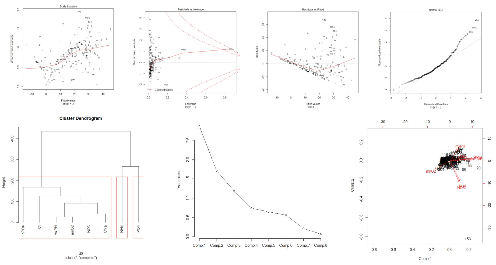
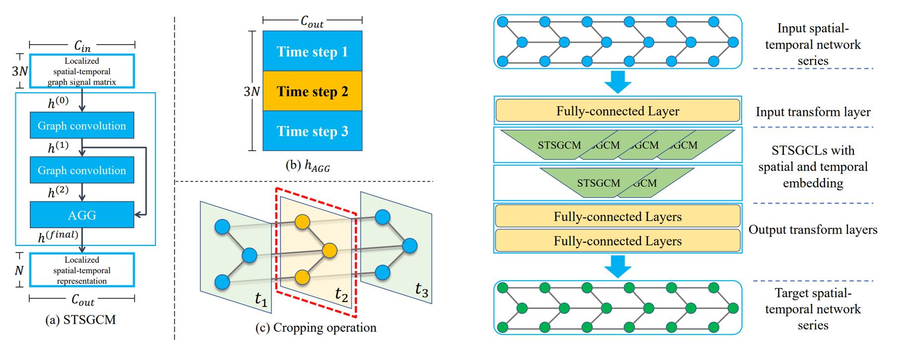
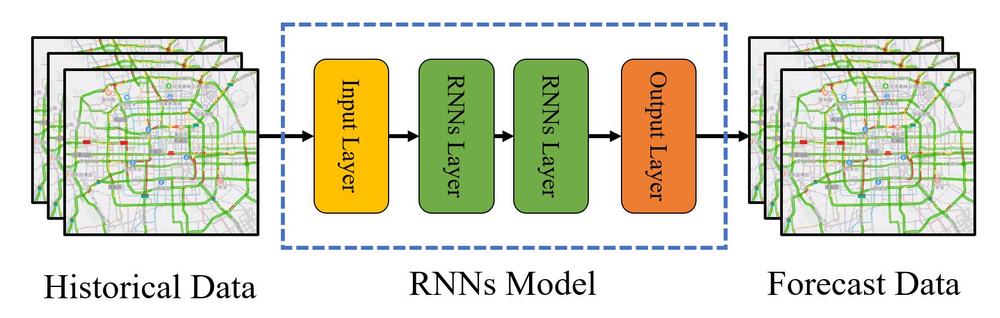

If you want to see more, please enter my [Github page](https://github.com/j1o2h3n).

<!-- 
-->

## Data Analysis
[Data Analysis](https://github.com/j1o2h3n/Data-Analysis) is a project that analyzes the composition of river samples and predicts the content of seaweed in the river. The programming language is R. The analysis methods used include regression analysis, principal component analysis, factor analysis and cluster analysis.

## STSGCN
[STSGCN](https://github.com/j1o2h3n/STSGCN) is a traffic prediction deep learning model proposed in the AAAI-2020 paper "Spatial-Temporal Synchronous Graph Convolutional Networks: A New Framework for Spatial-Temporal Network Data Forecasting". I use the PyTorch framework to implement the code of the model proposed in this paper.

## RNNs
[RNNs](https://github.com/j1o2h3n/RNNs) are a series of recurrent neural networks that I implemented based on Pytorch. I did not call the original library functions. I implemented three deep learning models of RNN, LSTM, and GRU by hand, and performed sequence task prediction experiments.

## DDGCN
DDGCN is a deep learning model for traffic prediction proposed during my internship at Didichuxing Inc. in 2021. The model has achieved state-of-the-art on two real-world public traffic datasets.

## DDSTGCN
[DDSTGCN](https://github.com/j1o2h3n/DDSTGCN) is a deep learning model for traffic prediction proposed by me in 2020. The model has achieved state-of-the-art on six real-world public traffic datasets.

## MRA-BGCN
[MRA-BGCN](https://github.com/j1o2h3n/MRA-BGCN) is a traffic prediction deep learning model proposed in the AAAI-2020 paper "Multi-Range Attentive Bicomponent Graph Convolutional Network for Traffic Forecasting". I use the PyTorch framework to implement the code of the model proposed in this paper.

## (2D)^2FPCA
[(2D)^2FPCA](https://github.com/j1o2h3n/2D2FPCA) is a project that I completed in 2019 about image recognition and classification tasks of machine learning dimensionality reduction, written in Matlab language.

## Finger vein
[Finger vein](https://github.com/j1o2h3n/Finger_vein) is a simple finger vein skeleton extraction project based on digital image processing method that I completed in 2018. It is written by using C++ language to call OpenCV library.

